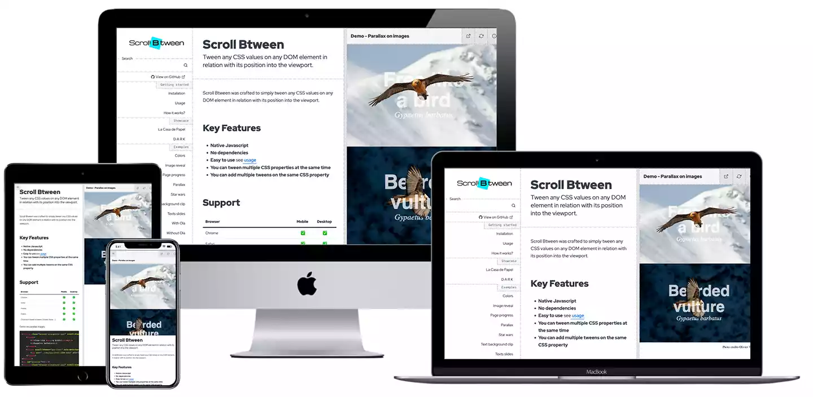

# Jekyll LibDoc

 > LibDoc is a Jekyll theme that was crafted to easily and quickly get properly designed documentation especially for CSS and Javascript libraries. It comes with a [built-in playground](https://olivier3lanc.github.io/Jekyll-LibDoc/libdoc-playground.html) and local search engine.

* **Dual context: LibDoc + Playground**  LibDoc was made to craft documentation with its own embedded demos and examples which have their own CSS and JS resources defined into the [config.yml](https://olivier3lanc.github.io/Jekyll-LibDoc/libdoc-config.html#playground), just like any code sandbox.  
* **Github Pages compatible**  LibDoc runs **without Gem, without plugin**, it is lightweight and can run locally, depending on the resources you set into the [configuration](https://olivier3lanc.github.io/Jekyll-LibDoc/libdoc-config.html).  
* **Gem free, plugin free**  LibDoc is Gem free and plugin free Jekyll theme and [Github Pages](https://pages.github.com/) compatible Jekyll theme.  
* **Github Pages compatible Jekyll theme**  Easily deploy your project on Github Pages, LibDoc is fully compatible.  
* **5 layouts**  LibDoc comes with dedicated [layouts](https://olivier3lanc.github.io/Jekyll-LibDoc/libdoc-layouts.html) for common documentation usages.  
* **Playground**  A major feature of the LibDoc Jekyll theme is its own built-in and configurable playground which is both a [layout](https://olivier3lanc.github.io/Jekyll-LibDoc/libdoc-layouts.html#playground) and a syntax highlighter extension. It extends the [syntax highlighter](https://olivier3lanc.github.io/Jekyll-LibDoc/libdoc-config.html#prismjs-syntax-highlighter) by running the specified code into a configurable context with user defined style sheets and scripts. [Learn more](https://olivier3lanc.github.io/Jekyll-LibDoc/libdoc-playground.html)  
* **Multiple lazy-loaded playgrounds on any page**  Add as mush as playgrounds on your documentation pages, playgrounds are loaded once into the viewport.  
* **Local search engine**  LibDoc has its own internal search engine based on [lunr.js](https://lunrjs.com/).  
* **Can work locally, even without Internet connection**  LibDoc can run locally with Jekyll serve or any http host - *assuming you set up local resources.*  
* **Customizeable settings**  LibDoc has its own settings editable on needs in the configuration file [config.yml](https://olivier3lanc.github.io/Jekyll-LibDoc/libdoc-config.html).  
* **Assets grid**  Built to allow visitors to view, download or copy URL of specified resources on your project. [Example](https://olivier3lanc.github.io/Jekyll-LibDoc/libdoc-layout-assets.html)  
* **Front matter**  Optional parameters ready to be set into the front matter of each page and every layout, like `category`, `order` in sidebar and `unlisted` feature. [Learn more](https://olivier3lanc.github.io/Jekyll-LibDoc/libdoc-front-matter.html)  
* **Github Flavoured Markdown**  LibDoc comes with native support of [Github Flavoured Markdown](https://github.github.com/gfm/). [Learn more](https://olivier3lanc.github.io/Jekyll-LibDoc/libdoc-markdown.html)  
* **Metadata**  LibDoc supports social networks metadata into its document `<head>` to enable proper social sharing. Favicon, image, author, color, language are supported in addition of site title and description. Metadata have dual settings for both [site/project](https://olivier3lanc.github.io/Jekyll-LibDoc/libdoc-config.html#metadata) and [playground](https://olivier3lanc.github.io/Jekyll-LibDoc/libdoc-config.html#playground)  
* **Sidebar**  All the necessary UI components to navigate through your project. Customizeable features such as logo/text management, search engine and possibility to add links of page that are not contained into the project. All available pages of the project are listed into the responsive sidebar, excepting unlisted ones. You can also assign category to pages and set a custom order. [Learn more](https://olivier3lanc.github.io/Jekyll-LibDoc/libdoc-config.html#sidebar)  
* **Logo**  The top left of the LibDoc’s theme is a homepage link that can display just site title or a custom logo. [Learn more](https://olivier3lanc.github.io/Jekyll-LibDoc/libdoc-sidebar.html#sidebar)  
* **Pages order and category**  Pages created can optionally have a category and an order assigned through their front matter. Then, it is possible to group pages links in the sidebar with a tip above the link. [Learn more](https://olivier3lanc.github.io/Jekyll-LibDoc/libdoc-front-matter.html)  
* **Unlisted pages**  It is possible to remove page link from the sidebar and search results thanks to the front matter `unlisted` property. [Learn more](https://olivier3lanc.github.io/Jekyll-LibDoc/libdoc-front-matter.html#unlisted)  
* **Prims as syntax highlighter**  LibDoc uses customizeable [Prismjs](https://prismjs.com/) syntax highlighter for both playground and markdown code highlight. [Learn more](https://olivier3lanc.github.io/Jekyll-LibDoc/libdoc-config.html#prismjs-syntax-highlighter)  
* **TOC - Table Of Content**  LibDoc supports `{:toc}` automatically generated from kramdown - markdown engine - TOC styling the table of content onto a right sidebar. [Learn more](https://olivier3lanc.github.io/Jekyll-LibDoc/libdoc-markdown.html#table-of-content-support)  
* **Shields and badges**   
Easily add [shields.io](https://shields.io/) badges into the footer. Create your own badges and add it through the config.yml. [Learn more](https://olivier3lanc.github.io/Jekyll-LibDoc/libdoc-badges.html)  