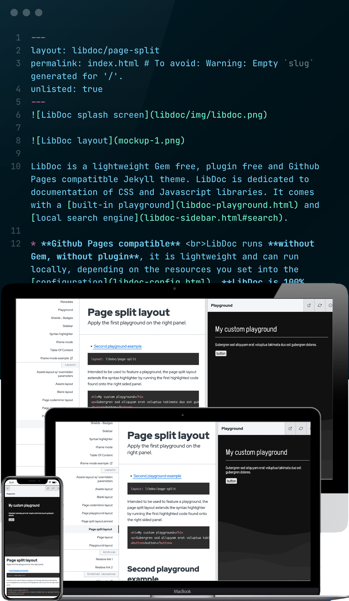

LibDoc is a lightweight Gem free, plugin free and Github Pages compatitble Jekyll theme. LibDoc is dedicated to documentation of CSS and Javascript libraries. It comes with a [built-in playground](libdoc-playground.html) and [local search engine](libdoc-sidebar.html#search).

* **Github Pages compatible** <br>LibDoc runs **without Gem, without plugin**, it is lightweight and can run locally, depending on the resources you set into the [configuration](libdoc-config.html). **LibDoc is 100% compatible with** [Github Pages](https://pages.github.com/).<br><br>
* **It is fast and easy to document and illustrate** <br>LibDoc was made to easily and quickly get perperly designed documentation.<br><br>
* **Dual context: LibDoc + Playground** <br>LibDoc was made to craft documentation with its own embedded demos and examples which have their own CSS and JS resources defined into the [config.yml](libdoc-config.html#playground), just like any code sandbox.
    ```html
    Playground - User defined context set up into config.yml
    └── html
        ├── head
        │   ├── playground.stylesheets in front matter config.yml
        │   │   ├── file.css
        │   │   ├── file.css
        │   │   └── ...
        │   └── playground.scripts_head in front matter config.yml
        │       ├── file.js
        │       ├── file.js
        │       └── ...
        └── body
            ├── playground.scripts_body_modules in front matter config.yml
            │   ├── js_module.js
            │   ├── js_module.js
            │   └── ...
            └── playground.scripts_body in front matter config.yml
                ├── file.js
                ├── file.js
                └── ...
    ``` 
* **5 main layouts** <br>LibDoc comes with dedicated [layouts](libdoc-layouts.html) for common documentation usages.<br><br>
* **Playground**<br> A major feature of the LibDoc Jekyll theme is its own built-in and configurable playground. It extends the [syntax highlighter](libdoc-syntax-highlighter.html) by running the specified code into a configurable context with user defined style sheets and scripts. [Learn more](libdoc-playground.html)<br><br>
* **100% static, no third-party service**<br> LidDoc works without any external service<br><br>
* **Multiple lazy-loaded playgrounds on any page** <br>Add as mush as playgrounds on your documentation pages.<br><br>
* **Local search engine**<br> LibDoc has its own internal search engine based on [lunr.js](https://lunrjs.com/). [Learn more](libdoc-sidebar.html#search)<br><br>
* **Can work local, even without Internet connection** <br>LibDoc can run locally with Jekyll serve or any http host - *assuming you set up local resources.*<br><br>
* **Customizeable settings**<br> LibDoc has its own settings editable on needs in the configuration file [config.yml](libdoc-config.html).<br><br>
* **Customizeable settings**<br> LibDoc has its own settings editable on needs in the configuration file [config.yml](libdoc-config.html).<br><br>
* **Assets grid**<br> Built to allow visitors to download necessary resources of the project, assets is a searchable layout that displays a grid of assets with copy link and download buttons. [Learn more](libdoc-assets.html)<br><br>
* **Front matter**<br> Optional parameters are ready to be set into the front matter of each page and every layout, like `category`, `order` in sidebar and `unlisted` feature. [Learn more](libdoc-front-matter.html)<br><br>
* **Github Flavoured Markdown**<br> LibDoc comes with native support of [Github Flavoured Markdown](https://github.github.com/gfm/). [Learn more](libdoc-markdown.html)<br><br>
* **Metadata**<br> LibDoc supports social networks metadata into its document `<head>` to enable proper social sharing. Favicon, image, author, color, language are supported in addition of site title and description. [Learn more](libdoc-metadata.html)<br><br>
* **Sidebar**<br> All the necessary UI components to navigate through the project. All component have customizeable features such as logo/text management, search engine and additional links. All available pages of the project are listed into the responsive sidebar, excepting unlisted ones. You can also assign category to pages and set a custom order. [Learn more](libdoc-sidebar.html)<br><br>
* **Logo**<br> The top left of the LibDoc’s theme is a homepage link that can display just site title or a custom logo. [Learn more](libdoc-sidebar.html#logo)<br><br>
* **Pages order and category**<br> Pages created can optionally have a category and an order assigned through their front matter. Then, it is possible to group pages links in the sidebar with a tip above the link. [Learn more](libdoc-front-matter.html)<br><br>
* **Unlisted pages**<br> It is possible to remove page link from the sidebar and search results thanks to the front matter `unlisted` property. [Learn more](libdoc-front-matter.html)<br><br>
* **Prims as syntax highlighter**<br> LibDoc uses customizeable [Prismjs](https://prismjs.com/) syntax highlighter for both playground and markdown code highlight. [Learn more](libdoc-syntax-highlighter.html)<br><br>
* **TOC - Table Of Content**<br> LibDoc supports `{:toc}` automatically generated kramdown - markdown engine - TOC styling the table of content onto a right sidebar as follows. [Learn more](libdoc-toc.html)<br><br>
* **Shields and badges**<br> <br>
Easily add [shields.io](https://shields.io/) badges into the footer. Create your own badges and add it through the config.yml. [Learn more](libdoc-shields-badges.html)<br><br>

#### Playground example

This homepage is an example of [libdoc/page-split](libdoc-layouts.html) layout. The following playground is automatically built and displayed on the right side of the screen. Playground settings are set into [config.yml](libdoc-config.html). The following code is included into the `<body>` part of the playground.

```html
<article>
    <p>
        <span scroll-btween="w1" 
                data-detector="detector-w1" 
                data-opacity="|0:1 to 98:1 to 100:0|" 
                data-transform="scale(|0:1 to 98:1 to 100:2|)" 
                data-letter-spacing="|0:-0.05 to 100:0|em">Scroll</span>
        <span scroll-btween="w2" 
                data-detector="detector-w2" 
                data-opacity="|0:0 to 2:1 to 98:1 to 100:0|" 
                data-transform="scale(|0:0 to 2:1 to 98:1 to 100:2|)" 
                data-letter-spacing="|0:-0.1 to 100:0|em">down</span>
        <span scroll-btween="w3" 
                data-detector="detector-w3" 
                data-opacity="|0:0 to 2:1 to 98:1 to 100:0|" 
                data-transform="scale(|0:0 to 2:1 to 98:1 to 100:2|)" 
                data-letter-spacing="|0:-0.1 to 100:0|em">spacing</span>
        <span scroll-btween="w4" 
                data-detector="detector-w4" 
                data-opacity="|0:0 to 2:1 to 98:1 to 100:0|" 
                data-transform="scale(|0:0 to 2:1 to 98:1 to 100:2|)" 
                data-letter-spacing="|0:-0.1 to 100:0|em">effect</span>
        <span scroll-btween="w5" 
                data-detector="detector-w5" 
                data-opacity="|0:0 to 2:1 to 98:1 to 100:0|" 
                data-transform="scale(|0:0 to 2:1 to 98:1 to 100:2|)" 
                data-letter-spacing="|0:-0.1 to 100:0|em">on your</span>
        <span scroll-btween="w6" 
                data-detector="detector-w6" 
                data-opacity="|0:0 to 2:1 to 98:1 to 100:0|" 
                data-transform="scale(|0:0 to 2:1 to 98:1 to 100:2|)" 
                data-letter-spacing="|0:-0.1 to 100:0|em">screen</span>
    </p>
</article>
<div id="detector-w1" class="detector">&nbsp;</div>
<div id="detector-w2" class="detector">&nbsp;</div>
<div id="detector-w3" class="detector">&nbsp;</div>
<div id="detector-w4" class="detector">&nbsp;</div>
<div id="detector-w5" class="detector">&nbsp;</div>
<div id="detector-w6" class="detector">&nbsp;</div>
        
<style>
    body {
        margin: 0; padding:0;
        background-color: black;
        color: white;
    }
    article {
        position: fixed;
        top: 0;
        left: 0;
        width: 100%;
        height: 100%;
    }
    p {
        font-size: 20vmin;
        font-weight: bold;
        letter-spacing: -0.1em;
        margin: 0;
        text-align: center;
        white-space: nowrap;
        position: relative;
        top: 50%;
        left: 50%;
        transform: translateX(-50%) translateY(-50%);
        height: 20vmin;
        line-height: 1em;
    }
    p > span {
        position: absolute;
        top: 0;
        left: 0;
        display: block;
        width: 100%;
        opacity: 0;
    }
    .detector { margin-top: 95vh; margin-bottom: 95vh; }
    #scroll-btween-debugbar { display: none; }
</style>
```
{:.playground title="Playground example"}